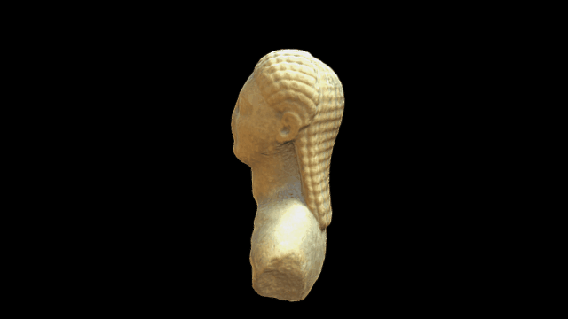

 

# A Kouros head from the Didyma sculptures

Files and images to recreate a 3D Kouros head

# License

CC BY-NC-SA

# Credits

This model was created by Daniel Pett using a Nikon D5100. Copyright Trustees of the British Museum.
